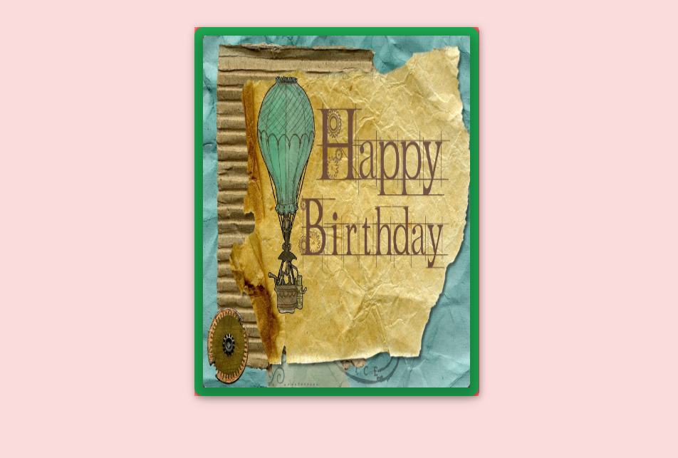
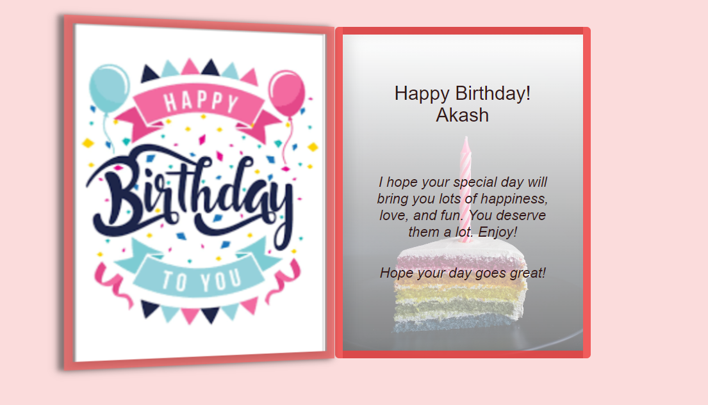

# Birthday Wish Card

    
    

 
<h3>Description</h3>
    

        ersonalized birthday message and include interactive elements to engage the recipient.
    

 
<h3>Features</h3>
    

        Customizable birthday message: Users can easily edit the birthday message displayed on the card to personalize it for the recipient.
        Interactive 3D animation: The card includes an eye-catching 3D animation that responds to user interactions, providing an enjoyable experience for the recipient.
        Responsive design: The birthday card is designed to be responsive and adapt to different screen sizes, ensuring a consistent experience on various devices.
    
