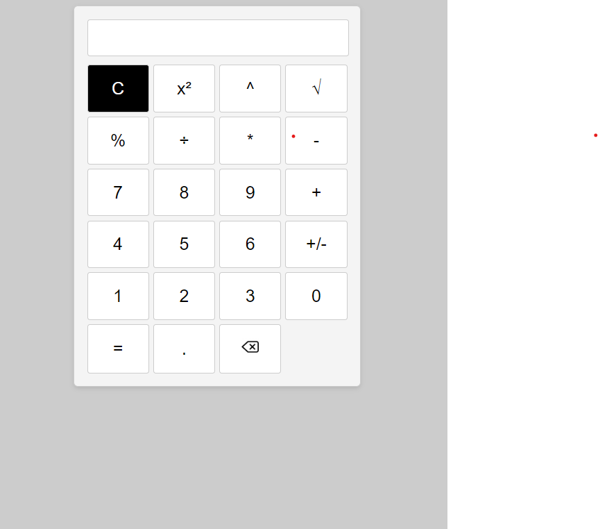

<h1>Calculator App</h1>

The calculator allows performing basic arithmetic operations such as <strong>addition (+), subtraction (-), multiplication (*), and division (/) </strong>. Users can enter numbers by clicking the respective buttons (0-9) and use the decimal point (.) for decimal numbers. The <b>"C"</b> button clears the input field, while the <b>"="</b> button evaluates the expression and displays the result. The calculator also supports advanced functions: "^" for exponentiation, <b>"²"</b> for squaring a number, and <b>"√"</b> for calculating the <b>square root</b>. Users can input complex calculations combining these functionalities to perform a wide range of mathematical operations.

