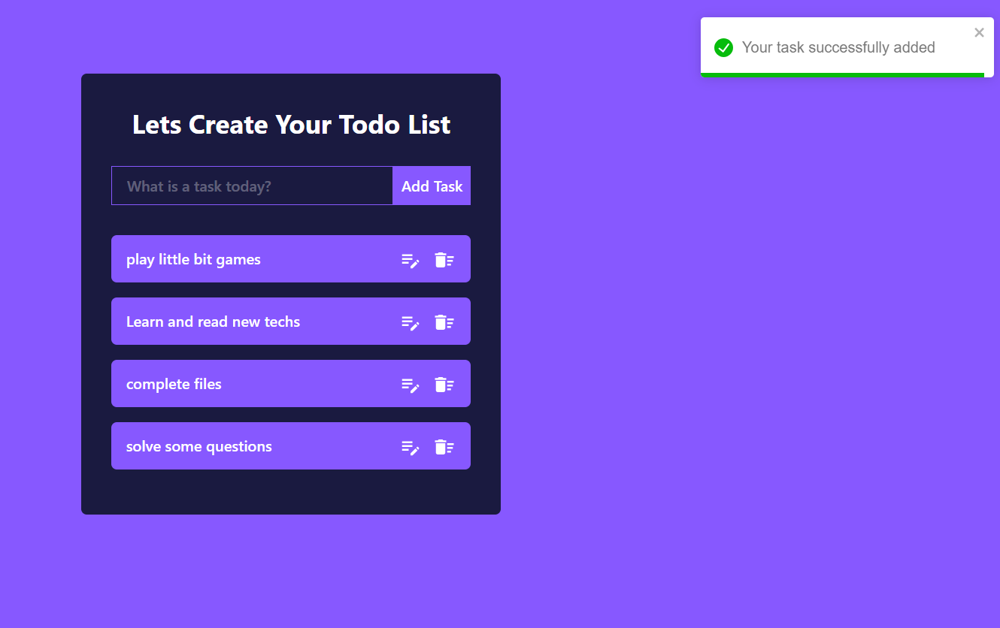

<h1>Todo List Application</h1>

Todo list application using React, Tailwind CSS, and Material UI icons, follow these steps. First, set up a new React project using create-react-app. Design a layout with a form input to add tasks and a list to display them. Utilize Tailwind CSS classes for styling. Implement state management in React to store and manage the tasks using the useState hook.
 

Add functionality to the form to add, update, and delete tasks. Use local storage in JavaScript to persist the tasks even after page reloads. When the app loads, retrieve tasks from local storage if available. Use Material UI icons for a visually appealing interface and smooth user experience.
 

To update tasks, enable users to click on a task to edit it, and save the changes accordingly. When a task is completed or no longer needed, provide an option to delete it. Implement proper error handling and validations to ensure the app functions flawlessly. Test the application rigorously to identify and fix any potential bugs.

